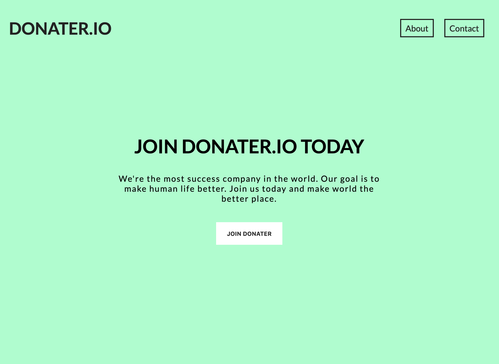

กลับมาอีกครั้งสำหรับบทความจาก **Code Nothing** นะครับ สำหรับบทความนี้เราจะมาพูดถึง **CSS** กัน แต่ก่อนอื่น **CSS** มันคืออะไรละ :thinking: ??

มีคนกล่าวว่า ...

> "Cascading Style Sheets (CSS) is a style sheet language used for describing the presentation of a document written in a markup language like HTML."

ซึ่งเราสรุปง่ายๆได้ว่า **CSS** คือ ภาษาที่ใช้ในการเติมแต่งสไตล์ต่างๆ ให้กับ **HTML** นั่นเอง สำหรับใครที่ยังไม่รู้จัก **HTML** สามารถตามไปอ่านบทความก่อนหน้านี้ได้[ที่นี่](www.codenothing.netlify.com)

เอาละ เราจะมาเริ่มต้นทำเพจง่ายๆกันเพจหนึ่งเพื่อเรียนรู้พื้นฐาน **CSS** และทบทวน **HTML** ไปในตัวกัน เริ่มต้นให้เราเข้าไปที่ [Codepen](www.codepen.io) ซึ่งเป็น _Text Editior_ ออนไลน์ เมื่อเข้าไปถึงหน้าแรกให้กด **Create a Pen** จากนั้นเราจะเจอพื้นที่ในการเขียนโค้ด 3 ส่วนได้แก่ **HTML**, **CSS**, และ **JS** ซึ่งวันนี้เราจะโฟกัสแค่เฉพาะ 2 ส่วนแรกนะครับ โดยโค้ดที่เป็น **HTML** เราจะเขียนลงในช่อง **HTML** และโค้ดที่เป็น **CSS** เราจะเขียนในช่อง **CSS** หลังจากที่ทุกคนพร้อมแล้ว เราจะมาเริ่มเขียนโค้ดกันเลย! :fire: :fire:

นี่คือหน้าตาของสิ่งที่เราจะทำกันวันนี้ครับ :triumph:



_เพื่อความกระชับของเนื้อหาเราจะเริ่มต้นเขียนโด้ดจาก **HTML** และ **CSS** ดังนี้ครับ_

**HTML**

```html
<html>
  <body>
    <header>
      <div class="my_header">
        <h1>DONATER.IO</h1>
        <ul class="nav">
          <li class="nav_item">About</li>
          <li class="nav_item">Contact</li>
        </ul>
      </div>
    </header>
    <section>
      <div class="section_main">
        <h1 class="section_heading">JOIN DONATER.IO TODAY</h1>
        <p class="section_text">
          We're the most success company in the world. Our goal is to make human
          life better. Join us today and make world the better place.
        </p>
      </div>
      <button class="join_button">JOIN DONATER</button>
    </section>
  </body>
</html>
```

**CSS**

```css
html,
body {
  height: 100%;
  margin: 0;
  box-sizing: border-box;
}

.my_header {
  display: flex;
  justify-content: space-between;
  align-items: center;
}

.nav {
  display: flex;
}

section {
  position: absolute;
  top: 0;
  width: 100%;
  height: 100%;
  display: flex;
  flex-direction: column;
  justify-content: center;
  align-items: center;
}
```

เริ่มต้นเราจะได้หน้า HTML เปล่าๆ ที่มีการแบ่ง layout ออกเป็น 2 ส่วนหลักๆ ตือ ส่วนของ `header` และส่วนของ `section` โดยเราจะมาเริ่มต้นเขียน **CSS** ในส่วนของ `header` กันก่อนครับ :fire:

```css
header {
  height: 110px;
  padding: 25px;
}
```

เราจะมาเริ่มทำความเข้าใจ **CSS** กันไปทีละส่วนนะครับ ตอนนี้ทุกคนจะสังเกตว่าเราได้เลือก HTML tag ที่เราต้องการมาเขียน **CSS** ภายใต้ปีกกา สำหรับส่วนอื่นๆ สามารถอธิบายได้ดังนี้

`padding: 25px` - ใช้ในการขยายพื้นที่ภายใน HTML tag ทั้งสี่ด้าน เราสามารถเลือกที่จะใช้ `padding` เฉพาะด้านใดด้านหนึ่งได้ เช่น `padding-top: 25px` เพื่อขยายพื้นที่แค่ด้านบนเป็นต้นนะครับ :triumph:

`height: 110px` - ใช้ในการกำหนดความสูงของของ HTML tag นั้นๆ เราสามารถกำหนดค่าที่จะแสดงได้ทั้งหน่วย `%` และ `px`

> **ก่อนการใส่ `padding`** 

> **หลังการใส่ `padding`** 

จากนั้นเราจะมาเริ่มเขียน **CSS** ให้กับ HTML tag ที่มี **class** กันครับ ก่อนอื่นเราจะมาทำความรู้จักกันก่อนว่า **class** คืออะไร :thinking:

**class** คือ คุณลักษณะอย่างหนึ่งที่เราสามารถกำหนดให้ HTML tag เพื่อความง่ายต่อการเขียน **CSS** โดยมีรูปแบบการเขียนคือ `.` ตามด้วยชื่อ **class** ดังนี้

```css
.nav {
  list-style: none;
}

.nav_item {
  padding: 6px 8px;
  margin-left: 10px;
  margin-right: 10px;
  border: 2px solid #222;
}
```

`list-style: none` - ใช้ในการลบจุดที่เกิดจากการใช้ `ul`

`margin-left: 10px` - ใช้ในการกำหนดระยะห่างระหว่าง HTML tag ทางด้านซ้าย

`margin-right: 10px` - ใช้ในการกำหนดระยะห่างระหว่าง HTML tag ทางด้านขวา

เนื่องจากเรามี `li` 2 tag ที่มี **class** `.nav_item` ดังนั้นแต่ละ `li` จะมี ระยะห่างทางด้านซ้าย และด้านขวาอย่างละ `10px`

`border: 2px solid #222` - ใช้ในการกำหนดขอบให้กับ HTML tag ที่เราเลือก โดยใช้ค่าสามค่าในการกำหนดรูปแบบของเส้นขอบ ค่าแรก `2px` เป็นการบอกความหนาของเส้นขอบ ใช้หน่วยเป็น `px` หรือ _pixel_ นั่นเอง ค่าที่สองเป็นการกำหนดรูปแบบของขอบในที่นี้เราใช้ `solid` ซึ่งเป็นเส้นขอบแบบธรรมดาและ ส่วนที่สามคือสีของเส้นขอบครับ

จาก **CSS** ด้านบนเราจะได้ `header` ที่มีหน้าตาดังนี้ ...


ผ่านไปสำหรับการเขียน **CSS** ในส่วนของ `header` นะครับ :tada: ต่อมาเราจะมาเริ่มเขียน **CSS** ในส่วนของ `section` กัน :triumph:

```css
.section_main {
  width: 500px;
  text-align: center;
}

.section_heading {
  font-size: 36px;
}

.section_text {
  letter-spacing: 1.4px;
}
```

จากโค้ดด้านบนเราได้ใช้ **CSS** ต่างๆ ดังนี้

`text-align: center` - ใช้ในการกำหนดตำแหน่งของข้อความเราให้อยู่ตรงกลาง

`font-size: 36px` - ใช้ในการกำหนดขนาดของตัวอักษร

`letter-spacing: 1.4px` - ใช้ในการเพิ่มระยะห่างของตัวอักษร

จากนั้นเราจะมาใส่ **CSS** ให้ปุ่ม `.join_button` กันครับ :fire:

```css
.join_button {
  padding: 15px 20px;
  border: none;
  background: #fff;
  font-weight: bold;
  margin-top: 20px;
}
```

`border: none` - ใช้ในการลบขอบทั้งสี่ด้านออก

`background: #fff` - ป็นการใส่สีพื้นหลังให้กับ HTML tag ที่เราเลือก โดยเราสามารถใช้โค้ดสีแบบ **HEX** , **RGB**, **HSL** หรือชื่อภาษาอังกฤษที่รองรับได้ เช่น `background: white` เป็นต้น ดูตัวอย่างเพิ่มเติมได้[ที่นี่](https://htmlcolorcodes.com/) 

`font-weight: bold` - ใช้ในการกำหนดควาเข้มของ font ตัวอักษร โดยปกติแล้วค่าเริ่มต้นจะเป็น `font-weight: normal`

สุดท้ายเราจะทำการใส่สีพื้นหลังให้กับเพจของเราดังนี้

```css
html,
body {
  /*  เขียนต่อจากโค้ดเดิม */
  background: #98ffcc;
}
```

ทั้งหมดนี้เราก็จะได้เพจๆ หนึ่งที่เกิดจากการผสมผสานระหว่าง HTML และ CSS แล้วนะครับ สำหรับใครที่อยากเห็นโค้ดเต็มๆ สามารถดูได้ที่ [Codepen](https://codepen.io/drifterz13/pen/oVmgay?editors=1100) ของผมเลยครับ

สุดท้ายนี้หวังว่าผู้อ่านทุกคนจะรู้สีกคุ้นเคย และเข้าใจการใช้งาน **CSS** กันมากยิ่งขึ้นนะครับ สำหรับมือใหม่อาจจะดูเข้าใจยากนิดนึง ยังไงถ้าได้ลองใช้บ่อยๆ ผมรับรองว่าจะใช้ได้คล่องมือมากขึ้นแน่นอน ขอบคุณสำหรับการติดตามครับ :smile:
